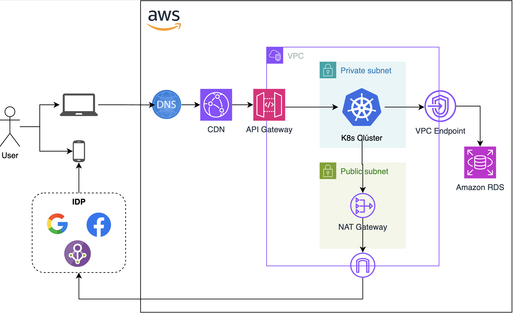

# MELI-Challenge

Backend con _Arquitectura de Microservicios_ que permite crear, eliminar y modificar persmisos de usuarios en una aplicación web y/o móvil. 

## 1. Requerimientos

Respecto a lo definido en la guía `IAM - Challenge TL Backend.pdf`, se extraen los requerimientos enumerados a continuación.

### 1.1. Requerimientos Funcionales

* Endpoint que genere un nuevo permiso. Debe incluir:
    * Nombre
    * Descripción
    * Tipo
    * Scope
* Endpoint que permita modificar atributos de un rol.
* Endpoint que permita consultar los roles disponibles.
* Endpoint que permita asociar un rol (permiso) con un usuario.
* Integración con OAuth/IDP para Autenticación Multi-Factor.

### 1.2. Requerimientos No-Funcionales

* Lenguaje base: Golang (Chi o Gorilla Mux) o Python (Flask).
* Manejo de ambientes CI/CD.
* Integración con OAuth/IDP

## 2. Arquitectura Cloud

Figura