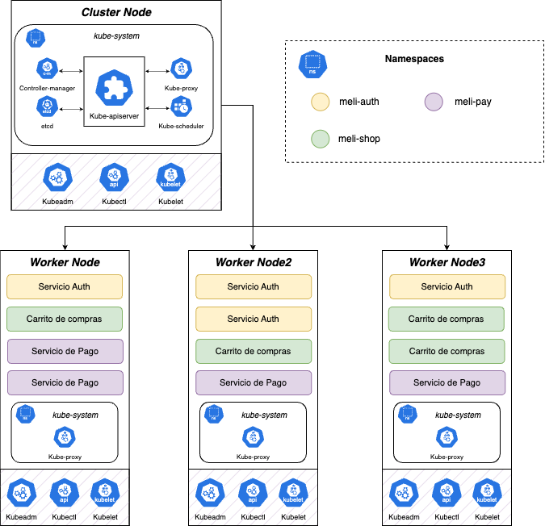

# Consideraciones

El ambiente de desarrollo tiene por objetivo evaluar los Requerimientos Funcionales del desarrollo. En ese sentido, se concentró el ambiente de desarrollo en las configuraciones respectivas al ámbito funcional en Kubernetes.

Figura 2. Clúster de Kubernetes.

En la Figura 2, se puede apreciar la orquestación de los diferentes microservicios en los _Worker Nodes_. Para asegurar una integración altamente resiliente, se recomienda que los pods con el microservicio de autenticación estén distribuidos de forma equitativa en todo el clúster.

## Configuración del ambiente 

Para habilitar el ambiente de desarrollo, se deben seguir los siguientes pasos:

1. Crear el namespace de `meli-auth`.
2. Habilitar los _Secrets_ y _ConfigMaps_ con las variables de entorno y archivos SQL para configurar los recursos.
3. Levantar los deployments de BD y Caché en el namespace.
4. Exponer los servicios de los deployments.
5. Crear y exponer el deployment con el microservicio.
6. Ejecutar un `Job` que habilite los esquemas de la base de datos.