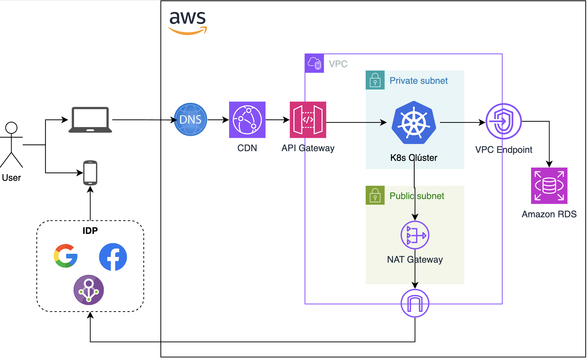

# Introducción

La solución se aloja en los recursos de infraestructura de AWS. Se trata de una solución contenerizada, orquestada mediante Kubernetes. El diseño general de la arquitecura cloud se puede apreciar en la Figura 1.

Figura 1. Arquitectura Cloud.

Como se aprecia en la Figura 1, siendo el presente un microservicio de autenticación, se espera que pueda integrarse con diferentes servicios frontend alojados en CloudFormation, teniendo un API Gateway que sirva como filtro a las diferentes peticiones llegadas desde la web. El microservicio debe ser orquestado en Kubernetes, a través de configuración de red privada. Como se espera integrar mediante protocolo OAuth, debe tener comunicación web a través de un NAT Gateway integrado con el Intenet Gateway de la VPC. 

Adicional, para comunicarse con los servicios de bases de datos (RDS) y caché, debe tener habilitados `VPC Endpoints` para incrementar el índice de seguridad cloud.