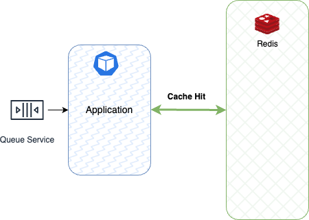

Figura 8. Lazy Loading: Success.

La Figura 8 muestra el proceso de una operación de lectura exitosa, donde la información del usuario se encuentra en Memcached, con token válido y dentro de los límites de expiración.