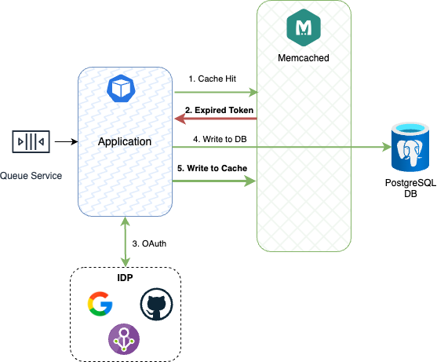

Figura 9. Lazy Loading: Expired Token.

En la Figura 9 se puede apreciar que la lectura en el caché fue exitosa. Sin embargo, el token ha superado la fecha de caducidad, por lo que el microservicio debe fallar con error __HTTP 401__. El usuario debe volver a autenticarse.