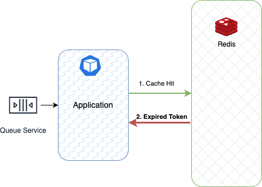

Figura 9. Lazy Loading: Expired Token.

En la Figura 9 se puede apreciar que la lectura en el caché fue exitosa. Sin embargo, el token ha superado la fecha de caducidad, por lo que el microservicio debe generar un nuevo token, actualizar el registro en la base de datos PostgreSQL y almacenar la información en el caché.