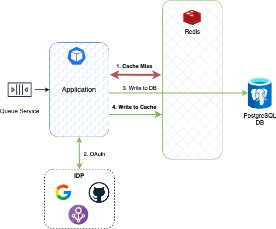

Figura 10. Lazy Loading: New User.

Para este caso, el usuario no se encuentra registrado en el caché, por lo que se valida con el _Identity Provider_, se almacena la información en la base de datos y en el caché para futuras operaciones de lectura.