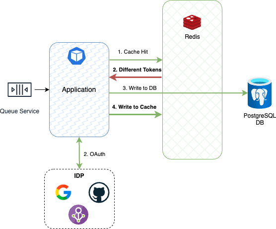

Figura 11. Lazy Loading: Different Tokens.

La situación de la Figura 11 puede deberse a dos posibles causas: 

1. Se venció el token del usuario, se autenticó y el _Identity Provider_ (IDP) le generó un nuevo token. En este caso, al validar desde el microservicio con el IDP, éste debería verificar que sí son iguales. De ser así, el microservicio almacenará el nuevo token en la base de datos y actualizará el caché.

2. En caso de que el token recibido sea diferente al del caché, se contraste con el del IDP y __siga siendo diferente__, significa que se trata de un posible ataque cibernético que busca _suplantar_ la identidad de un usuario. En este caso, lo que debe hacer el microservicio es reportarlo en la base de datos __bloqueando__ al usuario a través del atributo `bloqued` en `True`. De igual forma, registrarlo en el caché para que el atacante no pueda perjudicar la base de datos por sobrecarga de peticiones. El microservicio debe validar la dirección IP del atacante, enviar un correo electrónico al usuario original informándole de la situación y, en caso de ser él/ella quien está intentando acceder a su cuenta, desbloquearlo; de lo contratio, mantenerlo bloqueado. 
