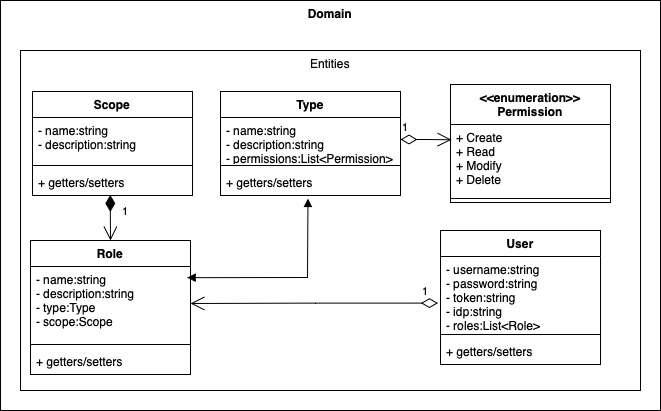

Figura 3. Arquitectura del Dominio: Entidades y Servicios.

### Entities

En la Figura 3, se aprecia la traducción de las necesidades del negocio, en términos de autenticación/autorización, a través de una experiencia centrada en el _usuario_.

El usuario (`User`), puede tener uno o varios roles (`Role`) y se relaciona con una plataforma de identidad (`IdentityPlatform`) que terceriza el protocolo de autenticación; razón por la que, en lugar de almacenar una contraseña, cuenta con los argumentos `token` y `token_expiry_date`.

Conforme a los _requerimientos funcionales_, el `Role` tiene un `Scope` y un `Type` registrados; donde el _Scope_ puede hacer referencia al área o departamento de la compañía, un país o región en específico, entre otros; y el _Type_ se refiere a la dimensión específica del rol, por lo que contiene los permisos CRUD asignados y un `weight`.

El argumento `weight` del tipo de rol permite __jerarquizar__ el rol. Por ejemplo, no es lo mismo el _presidente_ de una compañía a un _mensajero_. El `weight` permite hacer esa distinción, donde el peso del tipo _presidente_ podría tener 1.000, mientras que el de mensajero sería 1. De esta forma, el mensajero no podrá configurar los permisos del rol presidencial, pero sí viceversa.

Por otro lado, el gobierno de los permisos de un rol están definidos dentro de un _scope_. De esta forma, se garantiza la independencia de las diferentes áreas de la empresa, pero permitiendo la existencia de usuarios con roles en más de un área.

### Services

Una de las principales necesidades del problema es tercerizar la autenticación mediante protocolo OAuth, razón por la que en la Figura 3 se propone la gestión de objetos tipo `IdentityPlatform`. Estas plataformas pueden ser diferentes entidades de confianza, como GMail, Facebook, GitHub y Azure AD, entre otros.

Estas plataformas requieren de distintos argumentos, listados en sus atributos, en orden de autenticar a un usuario. Para garantizar la integridad de la cuenta de un usuario a través de este microservicio, se vincula la cuenta de un _identity provider_ con la de un usuario en específico.

El método `init_provider` será empleado como la base para conectar al usuario del microservicio con el `idp` establecido. 

