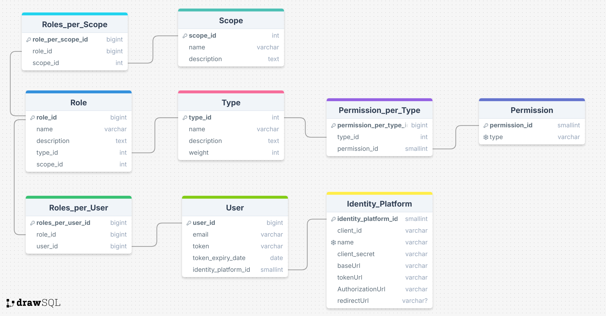

# Microservicio Auth

El objetivo del desarrollo trata sobre la construcción de un API REST que gestione las operaciones CRUD (crear, leer, eliminar y modificar) en roles y su asignación a diferentes usuarios. 

El microservicio debe cumplir los siguientes _requerimientos funcionales_.

* El microservicio debe permitir a los usuarios autenticarse mediante OAuth.
* Los usuarios con rol _"superadmin"_ podrán gestionar las operaciones CRUD sobre _roles_ y _permisos_, además de tener la facultad de asignar roles a todos los demás usuarios.
* Los usuarios que se reporten por primera vez recibirán un rol _"default"_, que no les permitirá gestionar roles ni permisos. Así como tampoco asignar roles a ningún otro usuario.
* El rol "default" se asumirá como _cliente_ o _usuario final_, por lo que sólo debería recibir un token de autenticación. No debe poder realizar ninguna operación CRUD (tampoco lectura) sobre los roles o permisos gestionados en el microservicio.

## 1. Arquitectura de Software

Como se mencionó en la sección de _Generalidades_, se aplica una arquitectura hexagonal sobre el problema, separándola en tres capas: dominio, aplicación e infraestructura, como se muestra en los esquemas a continuación. 

import Tabs from '@theme/Tabs';
import TabItem from '@theme/TabItem';
import Dominio from './capas/dominio.mdx';
import Aplicacion from './capas/aplicacion.mdx';
import Infra from './capas/infraestructura.mdx';

<Tabs>
    <TabItem value="dominio" label="Domain" default>
        <Dominio />
    </TabItem>
    <TabItem value="aplicacion" label="Application">
        <Aplicacion />
    </TabItem>
    <TabItem value="infraestructura" label="Infraestructure">
        <Infra />
    </TabItem>
    <TabItem value="total" label="Arquitectura Final">
        
        Figura 6. Arquitectura de Software.
    </TabItem>
</Tabs>

## 2. Persistencia de datos

En la capa de _dominio_ (ver Figura 3) se observan las entidades y sus interacciones dentro del microservicio. Como se aprecia, no se trata de interacciones complejas o dinámicas, por lo que una base de datos relacional debería ser suficiente para solucionar el almacenamiento de datos. En la Figura 7, se puede apreciar la propuesta de almacenamiento y relaciones entre tablas con lenguaje SQL.

Figura 7. Persistencia de datos con SQL.

La decisión específica sobre el tipo de motor de base de datos SQL depende de la transaccionalidad en las operaciones de escritura y lectura. 

* __Operaciones de escritura:__ se emplea en uno de dos escenarios. Ya sea cuando se autentica un nuevo usuario o cuando un usuario con permisos de administrador desea crear un nuevo rol o vincular un rol existente a otro usuario.
* __Operaciones de lectura:__ escenario de mayor frecuencia. Se emplea para verificar el token de autenticación, su fecha de caducidad y los roles adscritos a un usuario.

Como se espera que las operaciones de lectura sean mucho más frecuentes que las de escritura, podríamos decantarnos por emplear un caché basado en __Memcached__ para el almacenamiento de los datos de lectura del usuario (token y roles). Como no se evidencia una alta transaccionalidad en tareas de escritura, se empleará una base de datos __PostgreSQL__.

## 3. Concurrencia de datos

La _concurrencia de datos_ busca garantizar la integridad de la solución y el correcto funcionamiento cuando ocurren transacciones múltiples en un tiempo dado. Para ello, se aplicará una estrategia de __Lazy Loading__ entre Memcached con PostgreSQL, utilizando un _Queue Service_ en la nube para desacoplar los componentes de software, como se muestra en las Figuras 8, 9 y 10.

import Hit from './cache/hit.mdx';
import Miss1 from './cache/miss1.mdx';
import Miss2 from './cache/miss2.mdx';

<Tabs>
    <TabItem value="hit" label="Cache Hit: Success" default>
        <Hit />
    </TabItem>
    <TabItem value="miss1" label="Cache Hit: Expired Token">
        <Miss1 />
    </TabItem>
    <TabItem value="miss2" label="Cache Miss: New User">
        <Miss2 />
    </TabItem>
</Tabs>

Adicional, para garantizar el desacople entre flujos, emplearemos, a nivel de código, programación __reactiva__ y __funcional__.