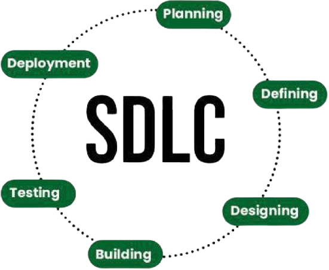

# Intro

El ciclo de vida de desarrollo de software (SDLC, por sus siglas en inglés) se trata de un framework que define las etapas de planeación y diseño de la __Arquitectura de Software__; definición de los estándares de _calidad_ y _seguridad_ del código mediante estrategias de _testing_; y definición de la estrategia de _packaging_ para las estrategias de deployment de artefactos en ambientes pre-productivos y productivos, como se resume en la siguiente Figura.

## Requerimientos Base

Para el problema en cuestión, se han definido los requerimientos enumerados a continuación.

### Funcionales

* Endpoint que genere un nuevo permiso. Debe incluir:
    * Nombre
    * Descripción
    * Tipo
    * Scope
* Endpoint que permita modificar atributos de un rol.
* Endpoint que permita consultar los roles disponibles.
* Endpoint que permita asociar un rol (permiso) con un usuario.
* Integración con OAuth/IDP para Autenticación Multi-Factor.

### No-Funcionales

* Lenguaje base: Golang (Chi o Gorilla Mux) o Python (Flask).
* Manejo de ambientes CI/CD.
* Integración con OAuth/IDP
