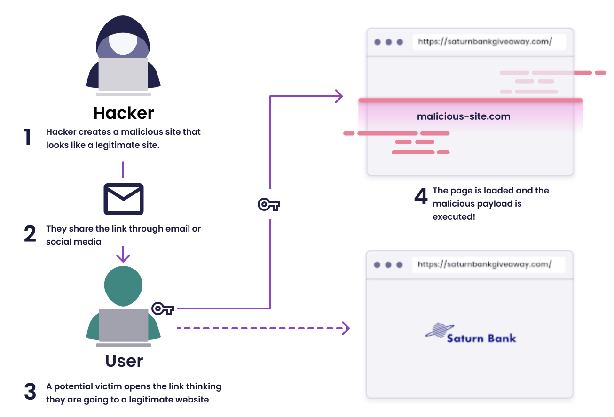

# CSRF

El ataque por _Cross-Site Reques Forgery_ es uno de los ataques de vulneración de usuarios más peligrosas y efectivas en el mundo. 



Figura. Ciberataque por CSRF. Fuente: [Snyk](https://learn.snyk.io/lesson/csrf-attack/).

Es posible implementar medidas contra ello desde el desarrollo del software. Si bien se puede atacar el problema desde el frontend, también se pueden aplicar medidas preventivas en el backend. En el caso de Flask, se implementó la librería `flask_wtf` para firmar las peticiones que se realizan en las comunicaciones entre diferentes componentes de software, incrementando así la confiabilidad de las transacciones. La configuración puntual implementada se puede observar a continuación.

```py
from flask import Flask
from flask_sqlalchemy import SQLAlchemy
from flask_wtf import CSRFProtect
from dotenv import load_dotenv
import os
import re
import redis
import yaml

# Inicialización de la aplicación y servicios externos (bd, cache, etc)

# Configuración de la aplicación y base de datos
class Config:
    def __init__(self, env):
        self.TESTING = env["testing"]
        self.SQLALCHEMY_DATABASE_URI = env["db"]["uri"]
        self.SQLALCHEMY_TRACK_MODIFICATIONS = env["track_modifications"]
        self.SECRET_KEY = env["db"]["secret"]

        self.cache = None
        if "cache" in env:
            self.cache = {
                "host": env["cache"]["host"],
                "port": env["cache"]["port"],
                "db": env["cache"]["db"],
            }

        self.CSRF_SECRET = env["csrf-secret"]
    
    # Inicialización
    def setup(self):
        app = Flask(__name__)
        app.config['SECRET_KEY'] = self.CSRF_SECRET
        app.config.from_object(self)
        db = SQLAlchemy(app)
        cache = self.setup_cache()
        return app, db, cache
```

Como se aprecia, la `SECRET_KEY` es la que se encarga de firmar las peticiones.