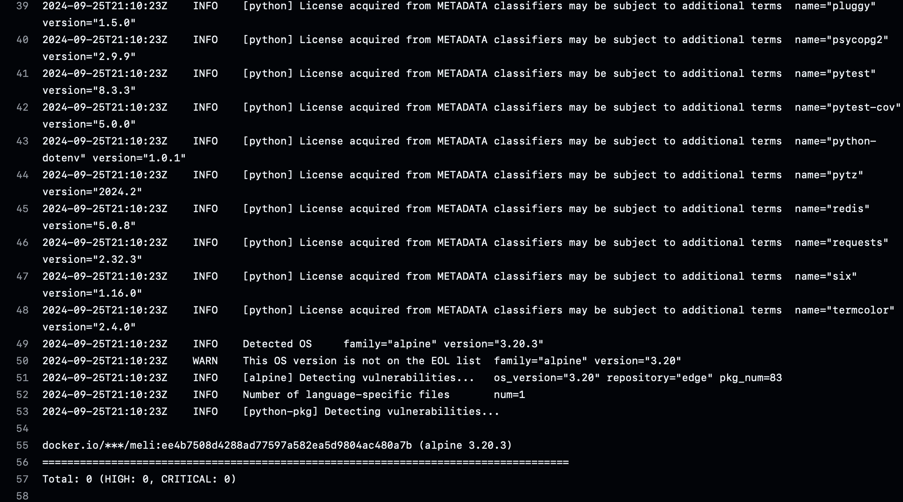

# Vulnerabilidades

Una de las actividades más importantes que garantizan la seguridad dentro del Ciclo de Vida del Desarrollo de Software es el seguimiento de vulnerabilidades. Para ello, usamos [Trivy](https://github.com/aquasecurity/trivy), una herramienta 100% Open Source y altamente competente que permite identificar vulnerabilidades en el artefacto generado. 

Con base en las consideraciones de diseño del contenedor del artefacto, podemos evidenciar que, como resultado, obtuvimos el siguiente reporte de vulnerabilidades.

Figura. Reporte de vulnerabilidades con Trivy.

Como se aprecia en la Figura, obtuvimos un reporte de 0 vulnerabilidades críticas y 0 altas.