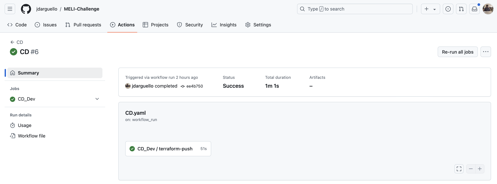

# Introducción

El pipeline de _Despliegue Continuo_ utiliza el artefacto construido en el pipeline de CI y lo despliega en los diferentes de infraestructura cloud. El pipeline elaborado en el presente reto se muestra a continuación.

Figura. Pipeline CD.

# IaC con Terraform

La infraestructura como código (IaC) busca gestionar, provisionar y configurar infraestructuras de manera declarativa y automatizada. Terraform es una herramienta de IaC agnóstica a la nube que gestiona recursos de la nube, instancias de cómputo, redes y almacenamiento mediante archivos de configuración, lo que facilita la creación, actualización y eliminación de entornos de forma reproducible y coherente. 

Los archivos de configuración de Terraform se encuentran alojados en la carpetad de `infraestructure`, para el ambiente `dev`. Allí también se encuentran los archivos para inicializar los esquemas de la base de datos en cualquier tipo de ambiente.

El pipeline está definido en `CD_Dev.yaml`.