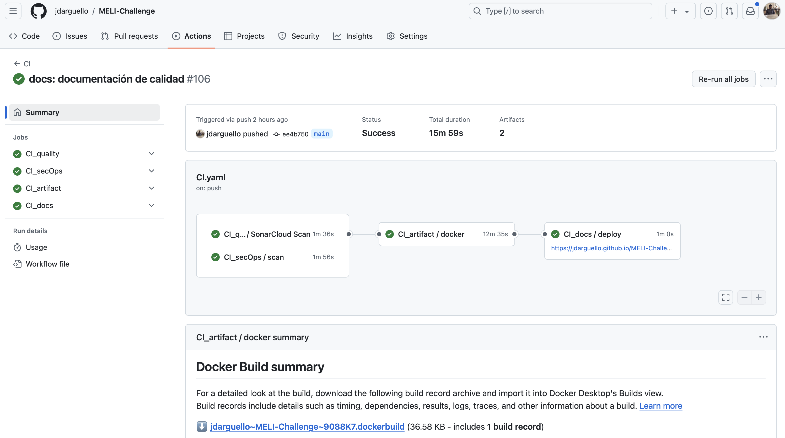

# Introducción

El pipeline de CI busca automatizar las estrategias y definiciones aplicadas en el SDLC. Durante el presente reto, se construyó el siguiente pipeline de CI en GitHub Actions.



Figura 2. Pipeline CI del _challenge_.

Como se puede apreciar, el pipeline de CI se divide en tres partes:

1. __Etapa de calidad:__ busca garantizar altos niveles de calidad y seguridad en el desarrollo del software. 
2. __Artefacto:__ genera y publica la imagen Docker para ser desplegada en los recursos de infraestructura cloud.
3. __Documentación:__ genera la documentación técnica del proyecto mediante GitHub Pages, con Docusaurus.

El pipeline CI principal es el siguiente:

```yaml
name: CI

on:
  push:
    branches:
      - main

jobs:
  CI_quality:
    uses: jdarguello/MELI-Challenge/.github/workflows/CI_quality.yaml@main
    secrets:
      SONAR_TOKEN: ${{ secrets.SONAR_TOKEN }}
      SONAR_ORGANIZATION: ${{ secrets.SONAR_ORGANIZATION }}
      SONAR_PROJECT_KEY: ${{ secrets.SONAR_PROJECT_KEY }}

  CI_secOps:
    uses: jdarguello/MELI-Challenge/.github/workflows/CI_secOps.yaml@main
    secrets:
      DOCKER_HUB_USERNAME: ${{ secrets.DOCKER_HUB_USERNAME }}

  CI_artifact:
    needs: 
      - CI_quality
      - CI_secOps
    uses: jdarguello/MELI-Challenge/.github/workflows/CI_artifact.yaml@main
    secrets:
      DOCKER_HUB_USERNAME: ${{ secrets.DOCKER_HUB_USERNAME }}
      DOCKER_HUB_TOKEN: ${{ secrets.DOCKER_HUB_TOKEN }}

  CI_docs:
    needs: CI_artifact
    permissions:
      contents: read
      pages: write
      id-token: write
    uses: jdarguello/MELI-Challenge/.github/workflows/CI_docs.yaml@main
```