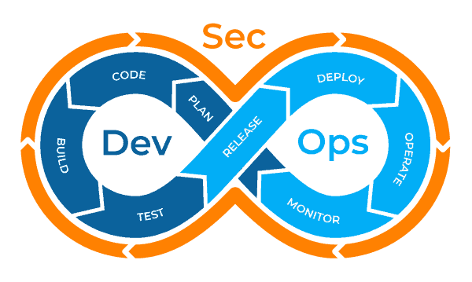

# Introducción

Las prácticas DevOps buscan complementar el Ciclo de Vida del Desarrollo de Software (SDLC) al incrementar la eficiencia y el valor agregado durante las diferentes operaciones. Se dividen, principalmente, en dos etapas:

1. _Continous Integration (CI):_ tiene por objetivo la generación del artefacto, producto del SDLC, de manera automática.
2. _Continous Deployment (CD):_ busca automatizar los despliegues en los diferentes ambientes pre-productivos, para la ejecución de pruebas Funcionales y No-Funcionales. Una vez superadas estas etapas, se procede con el despliegue automática en ambientes productivos.

DevSecOps complementa a las prácticas DevOps al añadir una capa de seguridad que busca incrementar los índices de seguridad dentro de la automatizaciónd del SDLC.

Figura 1. DevSecOps.